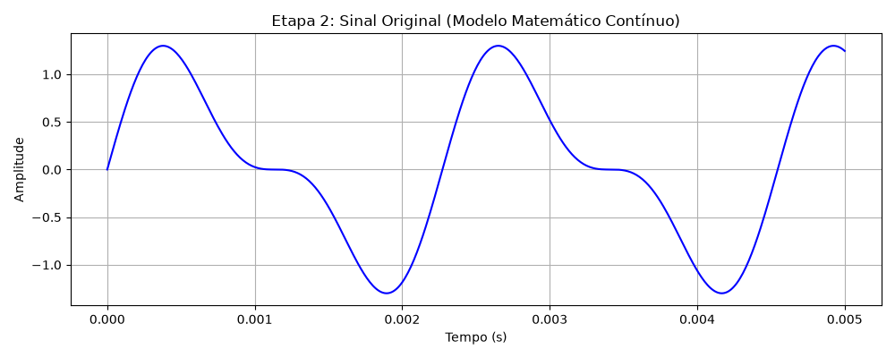
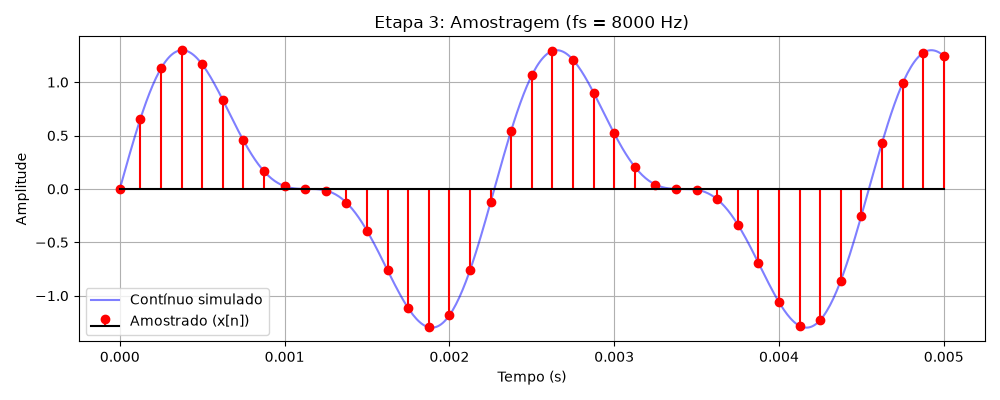
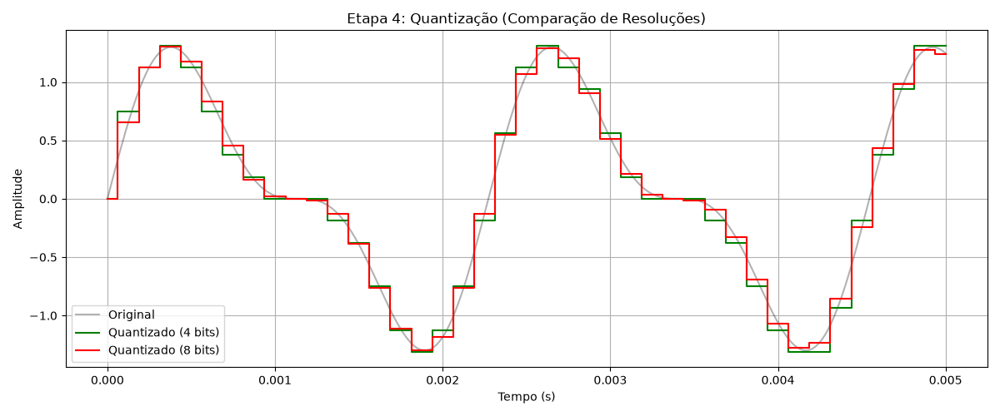
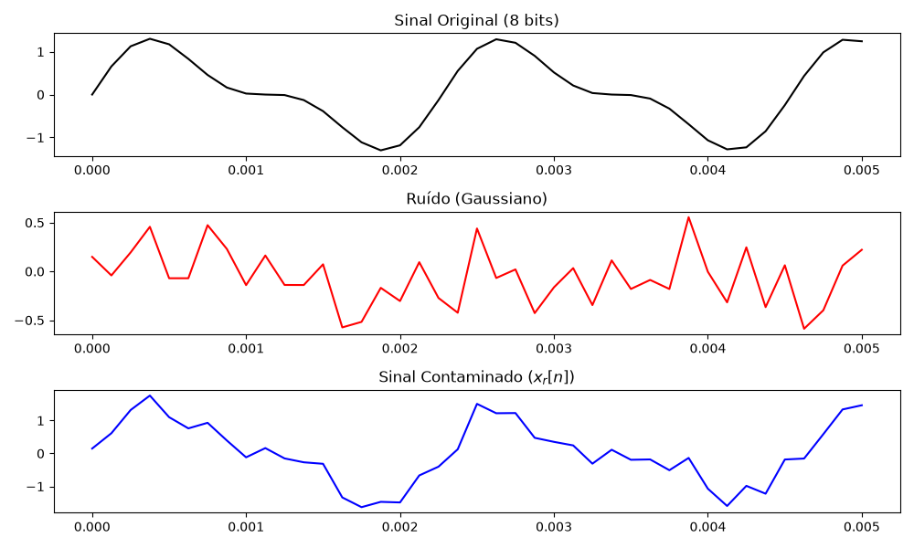
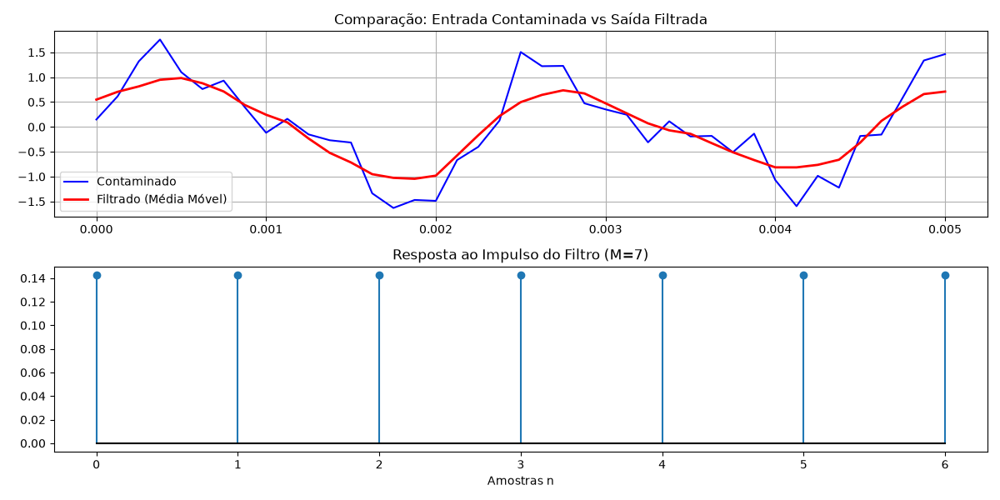

# Relatório: Mini Projeto Integrador (Parte 1)

**Simulação de um Sistema de Aquisição e Processamento de Sinais**

---

## 1. Escolha do Fenômeno e Modelagem Matemática (Etapas 1 e 2)

O fenômeno escolhido foi um **sinal de áudio sintético**, representando uma nota musical simples com a presença de um harmônico. Essa abordagem permite prever o comportamento frequencial do sistema e observar fenômenos como mascaramento por ruído de forma clara.

A modelagem matemática do sinal contínuo $x(t)$ foi definida como a soma de duas ondas senoidais:
$$x(t) = 1.0 \cdot \sin(2\pi \cdot 440 \cdot t) + 0.5 \cdot \sin(2\pi \cdot 880 \cdot t)$$

Os parâmetros utilizados têm o seguinte significado físico:
- **Amplitudes ($A_1=1.0$, $A_2=0.5$):** Representam a intensidade relativa de cada componente de frequência, dando à "nota" a sua cor (timbre).
- **Frequências ($f_1=440$ Hz, $f_2=880$ Hz):** Representam a fundamental (Nota Lá - A4) e o primeiro harmônico (uma oitava acima).

Ouça o sinal original gerado:
<audio controls src="som_original.wav"></audio>

---

## 2. Amostragem (Etapa 3)

Para realizar a análise digital do sinal contínuo, definiu-se a frequência de amostragem como $f_s = 8000$ Hz. Pelo Teorema de Nyquist, a taxa de amostragem deve ser maior que $2 \times f_{max}$ (no nosso caso, $2 \times 880 = 1760$ Hz). Escolher 8000 Hz garante uma margem segura, típica de áudio padrão telefônico.
O intervalo de amostragem é $T_s = \frac{1}{8000} = 0,000125$ s. O sinal amostrado obedece à equação $x[n] = x(nT_s)$.

---

## 3. Quantização (Etapa 4)

A amplitude do sinal contínuo oscila no intervalo de $[-1.5, 1.5]$. Simulamos a passagem por um conversor A/D experimentando duas resoluções:
- **$N_1 = 4$ bits:** Resulta em $2^4 = 16$ níveis de discretização.
- **$N_2 = 8$ bits:** Resulta em $2^8 = 256$ níveis de discretização.

No gráfico, nota-se que a versão em 4 bits gera "degraus" imprecisos (que produzem muito ruído de quantização). A versão de 8 bits reconstrói o sinal de modo muito fiel ao original, tornando os "degraus" praticamente imperceptíveis.

---

## 4. Inclusão de Ruído e Contaminação (Etapa 5)

Foi introduzida uma componente de perturbação $r[n]$ (um ruído Gaussiano branco com desvio padrão $\sigma = 0.3$), visando simular um chiado de fundo.
O sinal resultante é dado por:
$$x_r[n] = x_{q8}[n] + r[n]$$

A amplitude e tipo de ruído (ruído branco) foram selecionados para afetar um espectro amplo de frequências de modo consistente, imitando estática ou ruído térmico num circuito elétrico, sem distorcer as componentes principais.

Ouça o sinal contaminado pelo ruído Gaussiano:
<audio controls src="som_ruidoso.wav"></audio>

---

## 5. Processamento por Sistema LTI e Comparação (Etapa 6 e 7)

O sinal corrompido foi processado utilizando um sistema linear invariante no tempo (LTI): um filtro de média móvel onde convoluímos o sinal com a resposta ao impulso:
$$h[n] = \frac{1}{M} \{1, 1, \dots, 1\}$$

Escolheu-se **$M = 7$**. 
A escolha justifica-se no domínio da frequência: uma janela $M=7$ para a taxa de $f_s=8000$ Hz tem seu primeiro nulo em $8000/7 \approx 1142$ Hz. Como nossa frequência mais alta de interesse (harmônico) é 880 Hz, esse tamanho de janela suaviza o pico sem esmagar demais o som original da nota, atuando como um filtro passa-baixas moderado. A convolução $y[n] = x_r[n] * h[n]$ suavizou as flutuações rápidas.

Ouça o sinal filtrado:
<audio controls src="som_limpo.wav"></audio>

---

## 6. Discussão (Etapa 8)

Com base nas experimentações:

1. **Como o fenômeno foi representado matematicamente?**
   O sinal de áudio foi representado como a soma de duas sinusoides para emular uma frequência fundamental ($440$ Hz) com o seu primeiro harmônico ($880$ Hz).

2. **Como a escolha de $f_s$ modificou a representação do sinal?**
   A amostragem de $f_s = 8000$ Hz transformou o fenômeno contínuo no tempo em uma sequência de valores discretos. Como $f_s > 2 f_{max}$, o conteúdo frequencial foi preservado com segurança (evitando aliasing).

3. **Qual foi o efeito da quantização?**
   As amplitudes contínuas do sinal foram mapeadas para um conjunto finito de valores, resultando em formatos de escada em baixa resolução.

4. **Como o número de bits afetou o resultado?**
   O sinal a 4 bits apresentou saltos (degraus) drásticos que introduzem um forte "ruído de quantização". O sinal a 8 bits possui 256 níveis, criando degraus microscópicos e resultando em altíssima fidelidade ao sinal contínuo original.

5. **Qual foi o efeito do ruído?**
   O ruído Gaussiano branco borrou o traçado original e induziu um chiado agudo na reprodução de áudio, dispersando a energia ao redor da nota fundamental.

6. **Qual a resposta ao impulso do sistema utilizado?**
   Sendo a janela de média de $M=7$, a resposta ao impulso é um pulso retangular: $h[n] = [\frac{1}{7}, \frac{1}{7}, \frac{1}{7}, \frac{1}{7}, \frac{1}{7}, \frac{1}{7}, \frac{1}{7}]$.

7. **Por que o sistema utilizado pode ser considerado LTI?**
   Ele é um sistema LTI (Linear Time-Invariant) pois obedece à *linearidade* (escalar a entrada ou sobrepor sinais escala ou sobrepõe as respectivas médias) e *invariância no tempo* (uma nota tocada 1 segundo mais tarde será processada com média móvel da mesma forma, mas 1 segundo atrasada).

8. **Qual foi o efeito da convolução?**
   A operação espalhou a influência de cada amostra em amostras vizinhas, suavizando os "espinhos" da curva introduzidos pelo ruído aleatório.

9. **O sistema reduziu as variações introduzidas pelo ruído?**
   Sim. Visualmente o gráfico tornou-se mais regular e, acusticamente, o chiado intenso (ruído de alta frequência) foi atenuado.

10. **Houve alteração significativa do sinal de interesse?**
    Houve uma leve atenuação do pico máximo do sinal de interesse, juntamente com um sutil atraso de fase induzido pelo retardo do filtro causal, mas a nota permaneceu inalterada nas frequências base.

11. **Quais limitações foram observadas?**
    Filtros de média móvel atenuam gradualmente e possuem "lóbulos" laterais fracos que vazam resíduos. Ruídos de baixa frequência misturados com o som original não podem ser removidos. Se $M$ fosse mais agressivo (ex: $M=50$), a própria frequência fundamental (440 Hz) seria cortada.

12. **Como o modelo poderia ser melhorado?**
    Substituir a média móvel por filtros digitais baseados em IIR (como Butterworth) ou FIR avançados (com janelamento de Hanning/Hamming), possibilitando cortes bruscos projetados com precisão no espectro de frequência. Para ruídos sobrepostos à voz, técnicas de "Subtração Espectral" poderiam ser empregadas.

*(Obs: Todos os códigos e representações detalhadas da simulação encontram-se disponíveis no arquivo executável `mini_projeto.ipynb` e, quando compilados, as saídas interativas estão integradas na documentação).*
